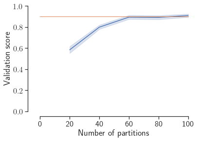
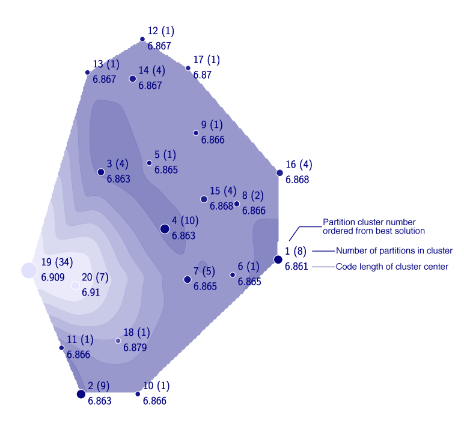

Solution landscape
==================

Visualize and explore the solution landscape of [Infomap](https://github.com/mapequation/infomap) based on clusters of network partitions. The [solution landscape notebook](solution-landscape.ipynb) helps you:

1. Identify how many times you need to run Infomap to obtain a solution with given resolution and accuracy.

    
    
2. Visualize the solution landscape with alternative solutions.

    
    
3. Explore how node assignments change between different solutions.

     
    
The notebook uses Infomap as an example, but works for any network clustering algorithm producing two-level or multilevel partitions. 

Reference
--------

The notebook presents methods introduced in
 
**Exploring the solution landscape enables more reliable network community detection**
 
Joaquín Calatayud, Rubén Bernardo-Madrid, Magnus Neuman, Alexis Rojas, and Martin Rosvall.
 
[Phys. Rev. E 100, 052308 (2019)](https://doi.org/10.1103/PhysRevE.100.052308)
 
[arXiv:1905.11230](https://arxiv.org/abs/1905.11230) 

Feedback
--------

If you have any questions, suggestions, or issues regarding the software,
please add them to [GitHub issues](https://github.com/mapequation/solution-landscape/issues)

Authors
-------

Daniel Edler, Anton Eriksson, Martin Rosvall

For contact information, see [mapequation.org/about.html](https://www.mapequation.org/about.html)

Terms of use
------------

See [LICENSE](LICENSE)
